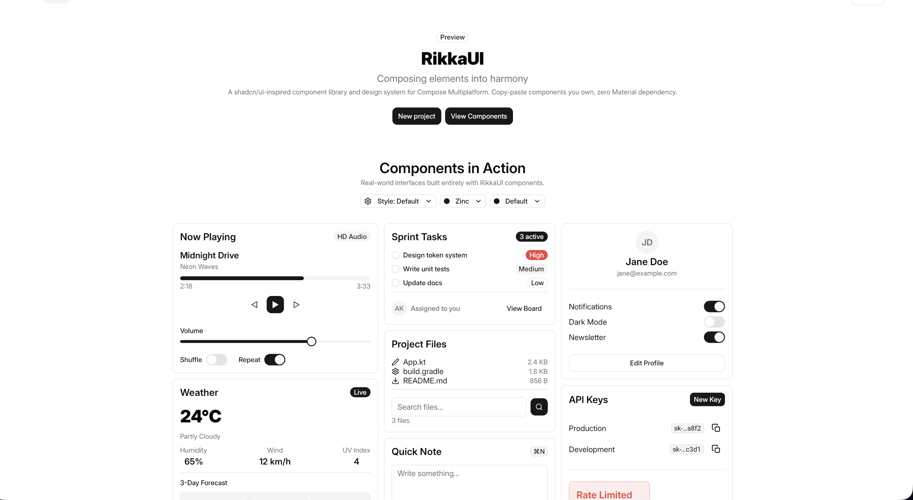

<div align="center">
<br/>

<br/>
<br/>

# RikkaUI

**The shadcn/ui of Compose Multiplatform.**

*Beautiful, production-ready components. Zero Material3. Full ownership.*

<br/>

<!-- Replace with an actual screenshot or GIF of your theme configurator -->


<br/>
<br/>

<p>
  
  
  
</p>
<p>
  
  
  <a href="https://github.com/rainxchzed/RikkaUi/stargazers">
    
  </a>
</p>

<br/>

[**Live Demo & Docs**](https://www.rikkaui.dev) &nbsp;&bull;&nbsp; [**Quick Start**](#-quick-start) &nbsp;&bull;&nbsp; [**Theming**](#-theme-system) &nbsp;&bull;&nbsp; [**Components**](#-components)

<br/>
</div>

---

## The Problem

Every Compose developer is stuck between two bad options: fight Material3's opinions on every screen, or build everything from scratch. There's been nothing in between.

RikkaUI is the third option. **40+ production-ready components** built on `compose.foundation` only — no Material3 anywhere. Copy the source into your project, own it fully, and customize without limits.

The same philosophy shadcn/ui brought to the web, now for Compose Multiplatform.

---

## Quick Start

**Option 1 — Gradle dependency** *(fastest, great for prototyping)*

```kotlin
// build.gradle.kts
dependencies {
    implementation("dev.rikkaui:foundation:0.1.0") // theme system
    implementation("dev.rikkaui:components:0.1.0") // all components
}
```

```kotlin
RikkaTheme {
    Button(text = "Get Started", onClick = { })
}
```

> Works out of the box for native Android projects — no KMP setup needed.
> For Compose Multiplatform, add to your `commonMain` source set.

**Option 2 — CLI** *(copy-paste with a command, full ownership)*

```bash
curl -fsSL https://rikkaui.dev/install.sh | bash
```

Then in your project:

```bash
rikkaui init    # set up your project for RikkaUI
rikkaui add button card input   # copy components into your source
rikkaui list    # browse all available components
```

Components are copied directly into your source. You own the code — no version conflicts, no breaking updates, no opinions you can't change.

Only `foundation` is required as a Gradle dependency — it provides the theme system your copied components build on.

---

## Theme System

One line changes your entire app's personality:

```kotlin
// Style presets — shapes, spacing, motion, type scale
RikkaTheme(preset = RikkaStylePreset.Default) { }  // Balanced
RikkaTheme(preset = RikkaStylePreset.Nova) { }     // Sharp & dense
RikkaTheme(preset = RikkaStylePreset.Vega) { }     // Rounded & bouncy
RikkaTheme(preset = RikkaStylePreset.Aurora) { }   // Spacious & large
RikkaTheme(preset = RikkaStylePreset.Nebula) { }   // Square & tight

// Color palettes
RikkaTheme(palette = RikkaPalette.Zinc) { }    // Pure & clean
RikkaTheme(palette = RikkaPalette.Slate) { }   // Cool blue tint
RikkaTheme(palette = RikkaPalette.Stone) { }   // Warm earth tint

// Or just the defaults
RikkaTheme { }
```

5 palettes × 7 accent colors × light/dark mode. Every token is overridable.

**Implicit color propagation** — Components automatically inherit the right foreground color via `LocalContentColor`. Icons, text, and spinners inside a Button just work:

```kotlin
Button(onClick = { }) {
    Icon(RikkaIcons.Send)  // automatically uses button's foreground color
    Text("Send")           // same — no manual color passing needed
}
```

Try the theme system interactively at [rikkaui.dev](https://www.rikkaui.dev).

---

## Components

40+ components, all built on `compose.foundation` only.

| Category | Components |
|----------|------------|
| Layout | Card, Separator, Scaffold, Scroll Area, Accordion, Collapsible, Table, List |
| Forms | Button, Icon Button, Input, Textarea, Select, Checkbox, Radio, Toggle, Toggle Group, Slider, Label |
| Data Display | Text, Badge, Avatar, Progress, Skeleton, Spinner, Kbd, Icon |
| Navigation | Tabs, Navigation Bar, Top App Bar, Breadcrumb, Pagination |
| Feedback | Dialog, Alert Dialog, Sheet, Toast, Alert, Tooltip, Popover, Hover Card |
| Overlay | Dropdown Menu, Context Menu |

Full docs and live previews at [rikkaui.dev](https://www.rikkaui.dev).

---

## Platform Support

| Platform | Status |
|----------|--------|
| Android | ✅ Stable |
| iOS | ✅ Stable |
| Desktop (JVM) | ✅ Stable |
| Web (WasmJs) | ✅ Stable |

---

## License

Apache 2.0 — see [LICENSE](LICENSE).

<div align="center">
<br/>

*RikkaUI (六花) — composing elements into harmony.*

</div>